# 画面設計書

**システム名**: マンション管理 AI プラットフォーム  
**対象バージョン**: 現行実装（2026年3月時点）  
**スクリーンショット格納先**: `docs/screenshots/`  
**注記**: 左サイドメニューはUI表示のみ。画面遷移の起点は「マンション一覧」→「物件詳細」→各機能グループ。

---

## 目次

1. [共通レイアウト](#1-共通レイアウト)
2. [物件管理（中心機能）](#2-物件管理中心機能)
   - 2-1. マンション一覧
   - 2-2. 物件詳細 — 基本情報タブ
   - 2-3. 物件詳細 — 組合員リストタブ
   - 2-4. 物件詳細 — 各種専門部会タブ
   - 2-5. 物件詳細 — 特記事項タブ
   - 2-6. 物件詳細 — その他ファイルタブ
3. [問合せ管理](#3-問合せ管理)
   - 3-1. チャット相談
   - 3-2. 相談履歴
4. [議案管理](#4-議案管理)
   - 4-1. 議案一覧
   - 4-2. AI議案書生成
   - 4-3. 議案詳細・編集
5. [議事録管理](#5-議事録管理)
   - 5-1. 議事録一覧
   - 5-2. 音声・メモ取込
   - 5-3. AI議事録生成
   - 5-4. 決定事項管理
6. [長期修繕計画管理](#6-長期修繕計画管理)
   - 6-1. 修繕計画ダッシュボード
   - 6-2. 修繕項目一覧
   - 6-3. 修繕履歴
   - 6-4. 積立金シミュレーション
   - 6-5. AI見直し分析
7. [規約改訂](#7-規約改訂)
   - 7-1. 規約改訂分析
   - 7-2. AI改訂案生成
   - 7-3. ナレッジベース管理
   - 7-4. 規約Wiki
   - 7-5. 年度別改訂管理
8. [管理適正評価](#8-管理適正評価)
   - 8-1. セルフチェック実施
   - 8-2. スコア詳細・改善策
   - 8-3. 評価履歴・推移

---

## 1. 共通レイアウト

全画面に共通して表示されるレイアウト構成。

### ヘッダー

| 要素 | 説明 |
|------|------|
| ロゴ・サービス名 | 左上「マンション管理 AI」アイコン付き |
| 物件名チップ | 選択中の物件名（例：「メゾンドオプテージ」）をオレンジ背景で表示 |
| 検索バー | グローバル検索 input（中央） |
| 通知アイコン | ベルアイコン（右上） |
| ユーザー情報 | ログインユーザー名（右上） |
| 機能グループナビ | 物件選択後に表示される機能ショートカットバー（物件詳細 / 議案管理 / 議事録管理 / 長期修繕計画管理 / 管理適正評価 / 規約改訂 / 問合せ管理 / AIチャット） |

### 左サイドメニュー（表示のみ・ナビゲーション対象外）

| メニュー項目 | 備考 |
|------------|------|
| ダッシュボード | |
| 物件管理 | 現在選択中メニューはオレンジ強調 |
| 管理適正評価 | |
| 管理規約管理 | |
| 長期修繕計画管理 | |
| 管理業務相談 | |
| 議事録管理 | |
| 総会議案書管理 | |
| データ取込 | |
| レポート | |
| 設定 | |

### パンくずナビ

各ページ上部に「マンション一覧 ＞ 物件名 ＞ 機能名」形式で表示。

---

## 2. 物件管理（中心機能）

### 2-1. マンション一覧

**スクリーンショット**: `01_condominium_list.png`

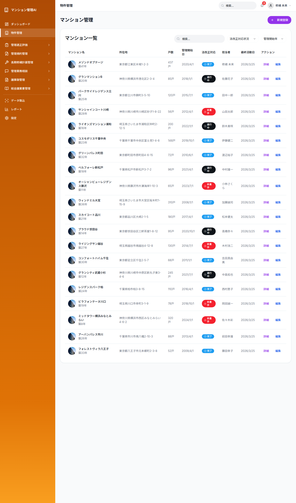

**URL**: `/condominiums`  
**画面タイトル**: マンション管理 / マンション一覧

#### 画面概要

登録されているすべてのマンションを一覧表示する中心画面。物件の検索・絞り込み・ソートを行い、各物件の詳細へ遷移するエントリポイント。

#### 画面構成

**ページヘッダー**

| 要素 | 説明 |
|------|------|
| ページタイトル | 「マンション管理」（ページ見出し）、「マンション一覧」（セクション） |
| 新規登録ボタン | 右上「＋新規登録」オレンジボタン |

**フィルタ行**

| 要素 | 内容 |
|------|------|
| 検索 input | マンション名・住所等でテキスト検索 |
| 法改正対応状況 | ドロップダウン（すべて / 完了 / 進行中 / 要着手） |
| 管理開始年 | ドロップダウン（年度フィルタ） |

**テーブル**

| カラム | 内容 |
|--------|------|
| マンション名 | 物件画像サムネイル＋名称＋建築年（「第N期」表示） |
| 所在地 | 都道府県・市区町村・番地 |
| 戸数 | 総戸数（N戸） |
| 管理開始日 | YYYY/M/D 形式 |
| 法改正対応 | バッジ（完了=青 / 進行中=黒 / 要着手=赤） |
| 担当者 | 担当管理者名 |
| 最終活動日 | 最終更新日付 |
| アクション | 「詳細」「編集」ボタン |

**ステータスバッジ色**

| バッジ | 色 |
|-------|-----|
| 完了 | 青（bg-blue-100） |
| 進行中 | 黒（bg-gray-800） |
| 要着手 | 赤（bg-red-100） |

**データ**: 最大20件表示（デモデータ）

---

### 2-2. 物件詳細 — 基本情報タブ

**スクリーンショット**: `02_condominium_detail_basic.png`

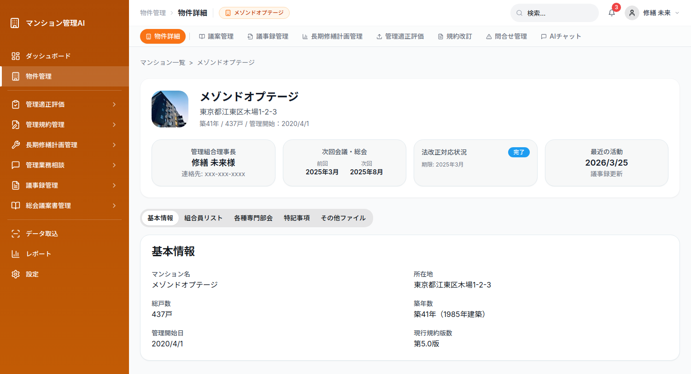

**URL**: `/condominiums/:id`（デフォルトタブ）  
**アクティブタブ**: 基本情報

#### 画面概要

選択したマンションの詳細情報を表示。ページ上部の物件ヘッダーと統計カード、続いて5タブ構成の詳細コンテンツで構成される。

#### 物件ヘッダー

| 要素 | 内容 |
|------|------|
| 物件画像 | サムネイル（左上） |
| マンション名 | 大見出し（例：メゾンドオプテージ） |
| 住所 | 都道府県・市区町村・番地 |
| 基本情報行 | 「第N期 / N戸 / 管理開始：YYYY/M/D」 |

#### 統計カード（4枚）

| カード | 表示内容 |
|-------|---------|
| 管理組合理事長 | 担当者名・連絡先 |
| 次回会議・総会 | 開催予定日・終了予定日 |
| 法改正対応状況 | 完了バッジ（青）＋最終対応日 |
| 最近の活動 | 最終活動日付・活動内容 |

#### ヘッダー機能ナビバー

物件詳細ページ専用の機能グループナビ（水平タブ形式）：  
「物件詳細」「議案管理」「議事録管理」「長期修繕計画管理」「管理適正評価」「規約改訂」「問合せ管理」「AIチャット」

#### タブ一覧

| タブ名 | 内容 |
|--------|------|
| 基本情報 | マンション名・所在地・総戸数・築年数・管理開始日・現行規約拡数 |
| 組合員リスト | 組合員テーブル |
| 各種専門部会 | 委員会カード一覧 |
| 特記事項 | カテゴリ別特記事項 |
| その他ファイル | 添付ファイル一覧 |

#### 基本情報コンテンツ

| 項目 | 説明 |
|------|------|
| マンション名 | 正式名称 |
| 所在地 | 完全住所 |
| 総戸数 | 例：437戸 |
| 築年数 | 例：第41年（1985年建築） |
| 管理開始日 | 例：2020/4/1 |
| 現行規約拡数 | 例：第5.0版 |

---

### 2-3. 物件詳細 — 組合員リストタブ

**スクリーンショット**: `03_condominium_detail_members.png`

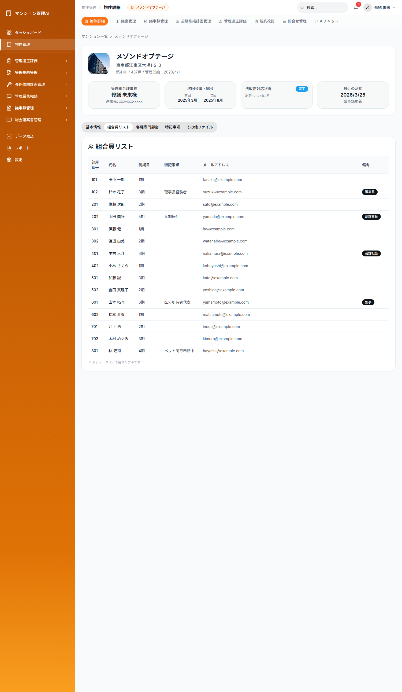

**アクティブタブ**: 組合員リスト

#### 画面概要

管理組合員（区分所有者）の一覧を表示する。役職・何期目・特記事項などを管理する。

#### テーブル構成

| カラム | 内容 |
|--------|------|
| 部屋番号 | 3桁（例：101, 201） |
| 氏名 | 組合員氏名 |
| 何期目 | 理事会参加期数（例：1期、3期） |
| 特記事項 | 役職バッジ（理事長・副理事長・会計担当・監事・彩疑等） |
| メールアドレス | 連絡先メール |
| 備考 | 自由記述 |

**役職バッジ色**

| 役職 | バッジ色 |
|------|---------|
| 理事長 | オレンジ |
| 副理事長 | 青 |
| 会計担当 | 緑 |
| 監事 | グレー |
| 彩疑 | 黄 |

**フッター**: 「※ 表示データはサンプルです」

---

### 2-4. 物件詳細 — 各種専門部会タブ

**スクリーンショット**: `04_condominium_detail_committees.png`

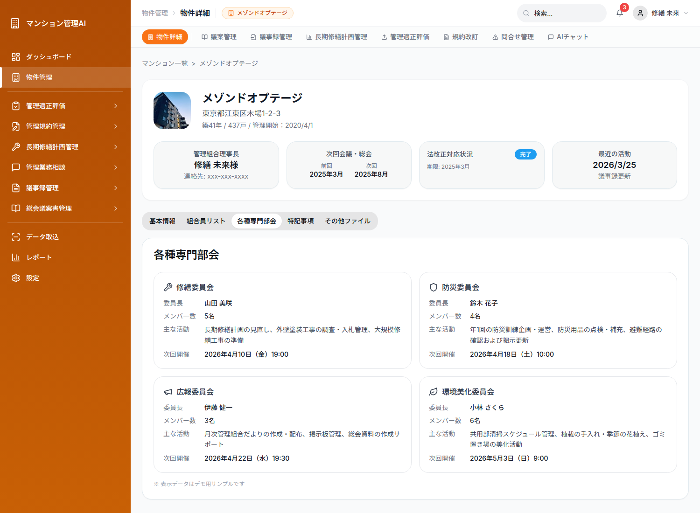

**アクティブタブ**: 各種専門部会

#### 画面概要

管理組合傘下の各専門委員会・部会情報を2列カードグリッドで表示する。

#### カード構成

各委員会カードに以下の情報を表示：

| 項目 | 内容 |
|------|------|
| 委員会名 | アイコン付き見出し（例：修繕委員会） |
| 委員長 | 担当者名 |
| メンバー数 | 人数（例：5名） |
| 主な活動 | 活動内容の説明文 |
| 次回開催 | 開催予定日時 |

**表示委員会例**：

| 委員会 | 委員長 |
|--------|--------|
| 修繕委員会 | 山田 廉平 |
| 防災委員会 | 熊木 花子 |
| 広報委員会 | 伊藤 健一 |
| 環境美化委員会 | 小林 さくら |

---

### 2-5. 物件詳細 — 特記事項タブ

**スクリーンショット**: `05_condominium_detail_notes.png`

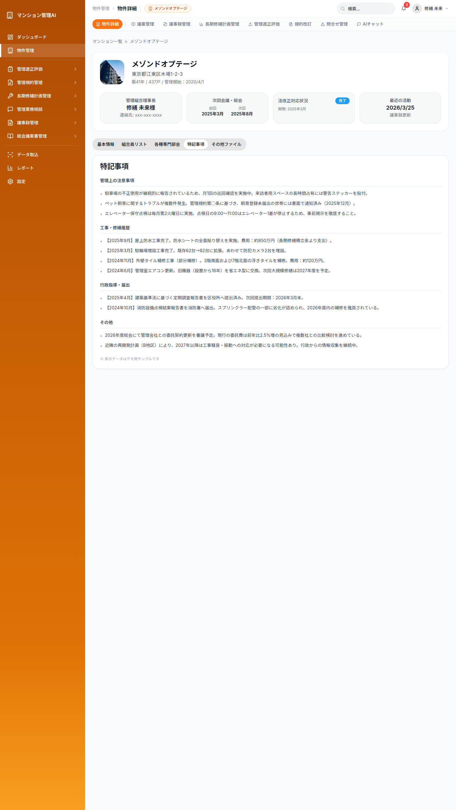

**アクティブタブ**: 特記事項

#### 画面概要

物件固有の特記事項をカテゴリ別にまとめて表示する。管理者間の引き継ぎ情報として機能する。

#### カテゴリ構成

| カテゴリ | 内容例 |
|---------|--------|
| 管理上の注意事項 | 駐輪場の不正使用・ペット飼育トラブル・エレベーター保守スケジュール等 |
| 工事・修繕履歴 | 屋上防水工事・駐輪場増設・外壁タイル補修・管理室エアコン更新等（日付付き） |
| 行政指導・審査 | 建築確認書類の提出・消防設備報告書提出状況等 |
| その他 | 近隣の長期修繕計画・外部からの提携可能性検討等 |

各カテゴリは見出し区切りのリスト形式で表示。

---

### 2-6. 物件詳細 — その他ファイルタブ

**スクリーンショット**: `06_condominium_detail_files.png`

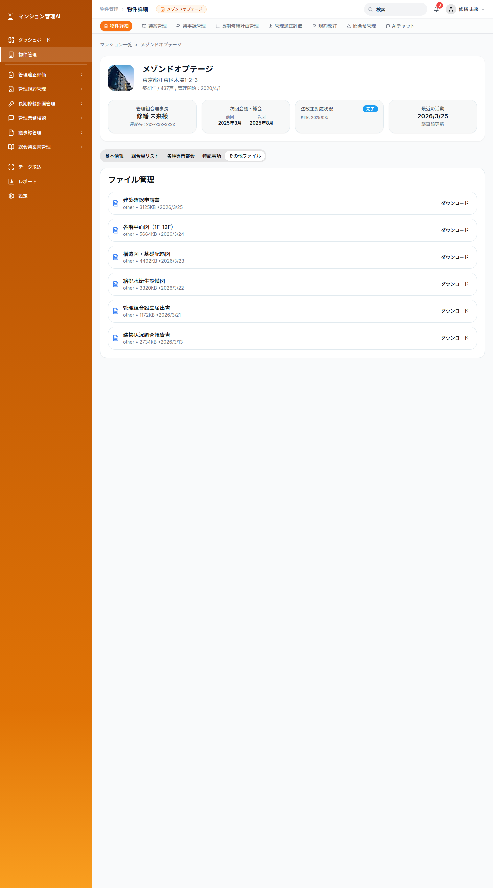

**アクティブタブ**: その他ファイル

#### 画面概要

物件に関連する各種書類ファイルを管理・ダウンロードできる。

#### ファイル一覧構成

各行に以下を表示：

| 要素 | 内容 |
|------|------|
| ファイルアイコン | ドキュメントアイコン（グレー） |
| ファイル名 | 書類名称 |
| ファイル種別・サイズ | 例：other · 3125KB |
| 登録日 | 例：2026/3/25 |
| ダウンロードボタン | 右端「ダウンロード」テキストボタン |

**登録ファイル例**：

| ファイル名 |
|-----------|
| 建築確認申請書 |
| 各階平面図（1F〜12F） |
| 構造図・基礎配筋図 |
| 給排水衛生設備図 |
| 管理組合設立届出書 |
| 建物状況調査報告書 |

---

## 3. 問合せ管理

物件詳細のヘッダーナビ「問合せ管理」、またはヘッダーの「AIチャット」ボタンから遷移。

### 3-1. チャット相談

**スクリーンショット**: `07_consultation_chat.png`

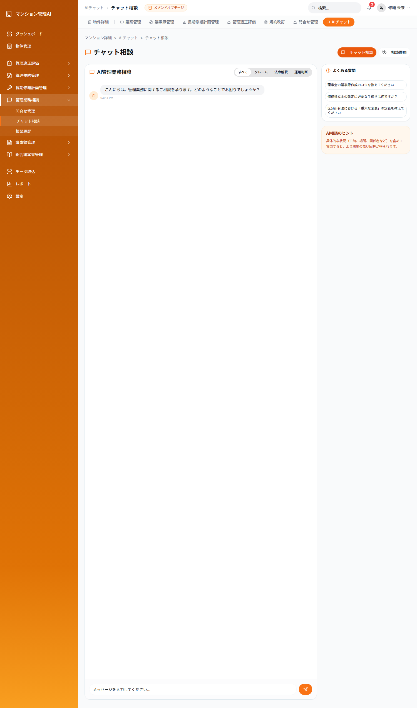

**URL**: `/consultation/chat?condominiumId=:id`  
**アクティブタブ**: チャット相談

#### 画面概要

管理業務に関する質問をAIエージェントに相談できる対話型チャット画面。

#### レイアウト（2カラム）

**左パネル（チャットエリア）**

| 要素 | 内容 |
|------|------|
| セクションタイトル | 「AI管理業務相談」 |
| カテゴリフィルタータブ | すべて / クレーム / 法令解釈 / 運用利用 |
| AI挨拶メッセージ | 「こんにちは。管理業務に関するご相談を承ります。どのようなことでお困りでしょうか？」（グレーバブル） |
| メッセージ入力欄 | 下部固定のテキスト入力（「メッセージを入力してください…」プレースホルダー） |
| 送信ボタン | オレンジ丸ボタン（右端） |

**右パネル（サポートエリア）**

| 要素 | 内容 |
|------|------|
| よくある質問 | クリック可能な質問リスト（例：「管事会の議事録作成のコツを教えてください」「相模建立全の改変に必要な手続きは何ですか？」「今月有効における 重大な変更 の定義を教えてください」） |
| AI相談のヒント | ベージュ背景のヒントボックス（「具体的な状況（日時、場所、関係者など）を含めて質問すると、より精確な回答が得られます」） |

**サブナビ**（ページ上部）: チャット相談（アクティブ） / 相談履歴

---

### 3-2. 相談履歴

**スクリーンショット**: `08_consultation_history.png`

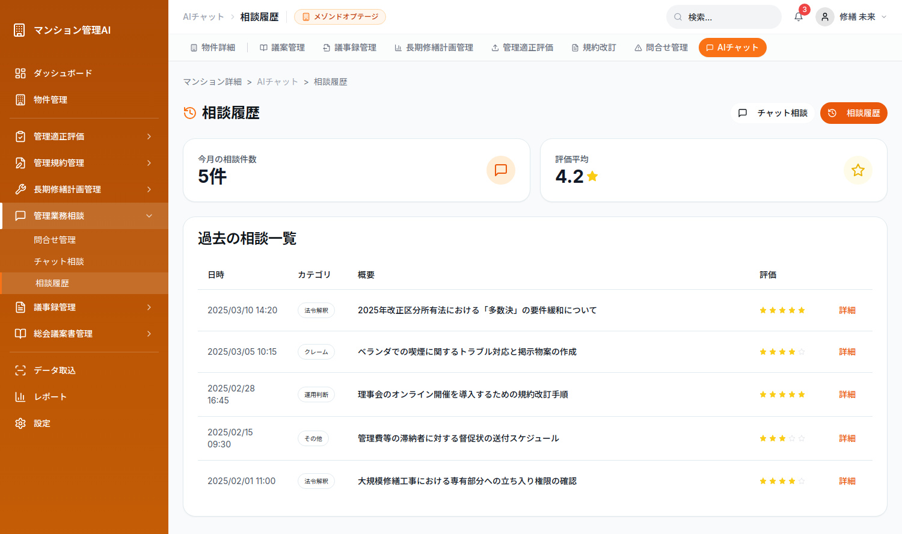

**URL**: `/consultation/history?condominiumId=:id`  
**アクティブタブ**: 相談履歴

#### 画面概要

過去のAI相談履歴を一覧表示。利用頻度と満足度を確認できる。

#### サマリカード（2枚）

| カード | 内容 |
|-------|------|
| 今月の相談件数 | 5件（吹き出しアイコン付き） |
| 評価平均 | 4.2★（星アイコン付き） |

#### 相談一覧テーブル

| カラム | 内容 |
|--------|------|
| 日時 | 相談日時（YYYY/MM/DD HH:MM） |
| カテゴリ | バッジ（法令解釈 / クレーム / 通常相談 / その他） |
| 概要 | 相談内容のサマリ文 |
| 評価 | 星評価（★1〜5） |
| （操作） | 「詳細」テキストリンク |

**相談履歴例**:

| 日時 | カテゴリ | 概要 |
|------|---------|------|
| 2025/03/10 14:20 | 法令解釈 | 2025年改正区分所有法における「多数決」の基準緩和について |
| 2025/03/05 10:15 | クレーム | ベランダでの喫煙に関するトラブル対応と掲示物製作の作成 |
| 2025/02/28 16:45 | 通常相談 | 理事会のオンライン開催を導入するための規約改訂手順 |
| 2025/02/15 09:30 | その他 | 管理費等の滞納者に対する督促状の送付スケジュール |
| 2025/02/07 11:00 | 法令解釈 | 大規模修繕工事における専有部分への立ち入り検査の確認 |

---

## 4. 議案管理

物件詳細のヘッダーナビ「議案管理」から遷移。

### 4-1. 議案一覧

**スクリーンショット**: `09_proposals_list.png`

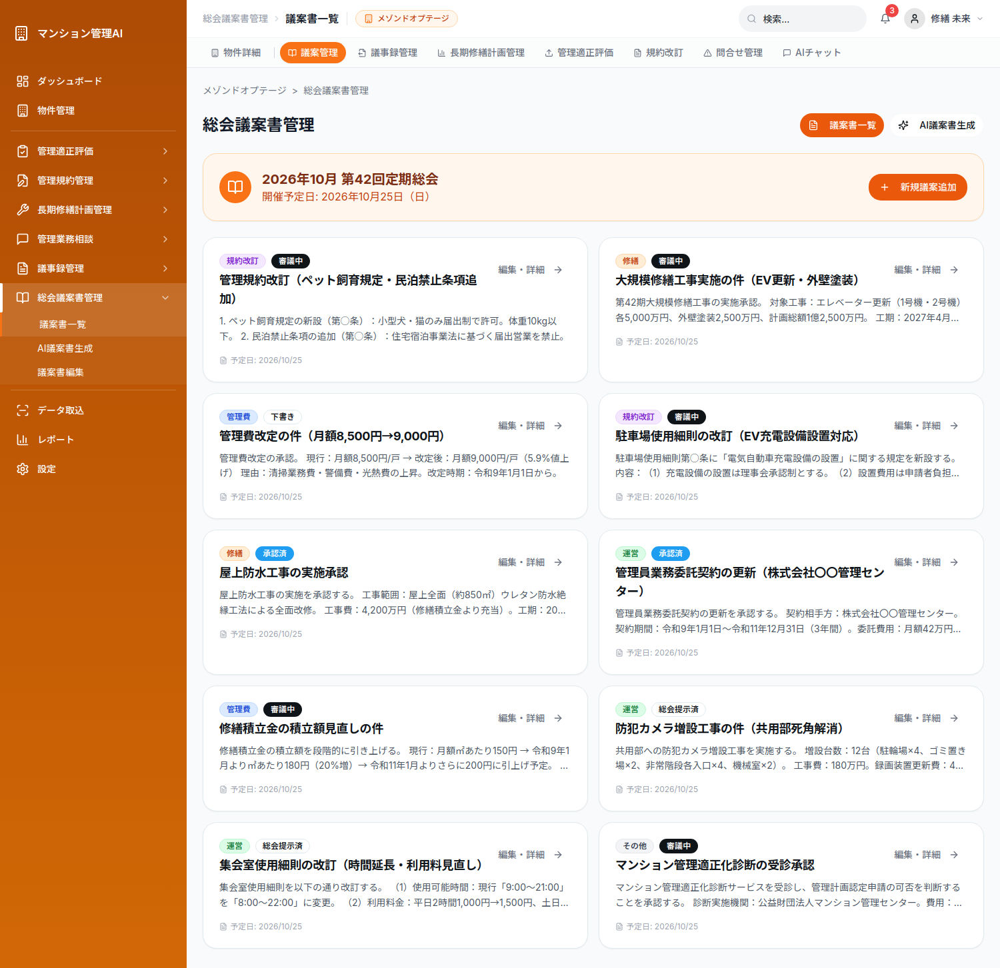

**URL**: `/proposals/list?condominiumId=:id`  
**アクティブメニュー**: 議案一覧

#### 画面概要

総会・理事会に提出予定の議案書を2列カードグリッドで管理する。

#### 次回総会バナー

オレンジ背景のバナーに次回総会情報を表示：  
「2026年10月 第42回定期総会 開催予定日: 2026年10月25日（日）」

#### ページ操作ボタン

| ボタン | 説明 |
|--------|------|
| ＋新規議案追加 | 新しい議案を追加する |

**サブナビ（左メニュー展開）**: 議案一覧 / AI議案書生成 / 議案書編集

#### 議案カード

2列グリッドで表示。各カードの構成：

| 要素 | 内容 |
|------|------|
| 優先度タグ | 緑「規約」/ 橙「管理費」/ 青「工事」/ グレー「その他」 |
| ステータスバッジ | 「審議中」「下書き」等 |
| 議案タイトル | 件名（太字） |
| 説明文 | 概要テキスト（2〜3行） |
| 日付 | 予定日（YYYY/MM/DD） |
| 操作 | 「編集」「詳細 →」リンク |

**議案カード例（10件）**:

| 議案 | カテゴリ |
|------|---------|
| 管理規約の一部改訂（ペット飼育規定・民泊禁止条項追加） | 規約 |
| 大規模修繕工事実施の件（EV更新・外壁塗装） | 工事 |
| 管理費改定の件（月額8,500円→9,000円） | 管理費 |
| 駐車場使用細則の改訂（EV充電設備設置対応） | 規約 |
| 屋上防水工事の実施承認 | 工事 |
| 管理員業務委託契約の更新（株式会社〇〇管理センター） | 総会 |
| 修繕積立金額見直しの件 | 管理費 |
| 防犯カメラ増設工事の件（共用部死角解消） | 工事 |
| 集会室使用細則の改訂（時間延長・利用料見直し） | 総会示 |
| マンション管理適正化診断の受診承認 | その他 |

---

### 4-2. AI議案書生成

**スクリーンショット**: `10_proposals_generate.png`


**URL**: `/proposals/generate?condominiumId=:id`  
**ページタイトル**: 新規議案書作成（AIアシスト）

#### 画面概要

AIを使って議案書の本文・文案を自動生成する画面。左にフォーム、右にAIプレビューが表示される2カラムレイアウト。

#### 左パネル（議案基本情報フォーム）

| フィールド | 種別 | 例 |
|-----------|------|-----|
| 議案タイトル | テキスト入力 | 管理規約の一部改訂について |
| カテゴリ | ドロップダウン | 規約 |
| 決議種別 | ドロップダウン | 特別決議 |
| 要旨・背景 | テキストエリア | 2025年の法改正に合わせ、当マンションの規約も最新の標準規約に準拠させる必要がある。 |

**生成ボタン**: 「AI議案書・文案生成」（オレンジ、フォーム下部）

#### 右パネル（AIプレビューエリア）

フォーム入力前は「左のフォームを入力してAI分析を閲覧してください」プレースホルダー表示。  
生成後は議案書本文・文案が表示される。

---

### 4-3. 議案詳細・編集

**スクリーンショット**: `11_proposals_edit.png`

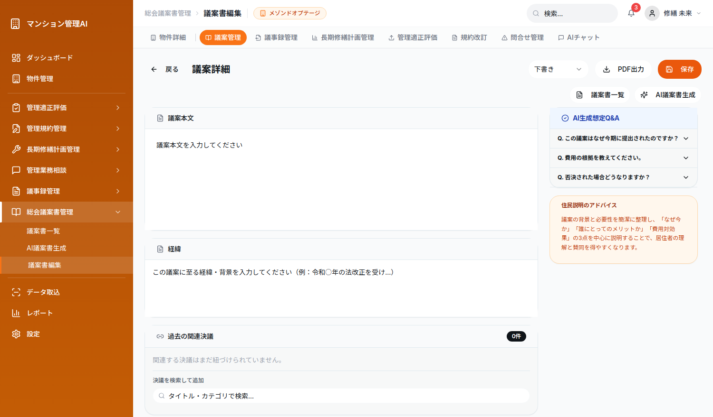

**URL**: `/proposals/edit?condominiumId=:id`  
**ページタイトル**: 議案詳細

#### 画面概要

議案の本文・経緯・過去の関連決議を編集する詳細画面。右パネルにAIサポート機能を配置。

#### ページヘッダー操作

| ボタン | 説明 |
|--------|------|
| ← 戻る | 議案一覧に戻る |
| 下書き▼ | ステータス変更ドロップダウン |
| PDF出力 | PDF形式でエクスポート |
| 保存 | 変更を保存 |
| AI議案書生成 | AI生成画面へ遷移 |

#### 左パネル（編集エリア）

| セクション | 内容 |
|-----------|------|
| 議案本文 | テキストエリア（フリーテキスト入力） |
| 経緯 | 議案に至る背景・経緯テキストエリア（例「令和N年の法改正を受け…」） |
| 過去の関連決議 | 「決議を検索して追加」検索ボックス＋関連決議一覧（0件時は「関連する決議はまだ紐づけられていません」） |

#### 右パネル（AIサポート）

| 要素 | 内容 |
|------|------|
| AI生成想定Q&A | アコーディオン形式（「この議案はなぜ今期に提案されたのですか？」「議案の根拠を教えてください」「否決された場合どうなりますか？」） |
| 住民説明のアドバイス | ベージュ背景のアドバイステキスト（反対意見への対応方法など） |

---

## 5. 議事録管理

物件詳細のヘッダーナビ「議事録管理」から遷移。

### 5-1. 議事録一覧

**スクリーンショット**: `12_minutes_list.png`

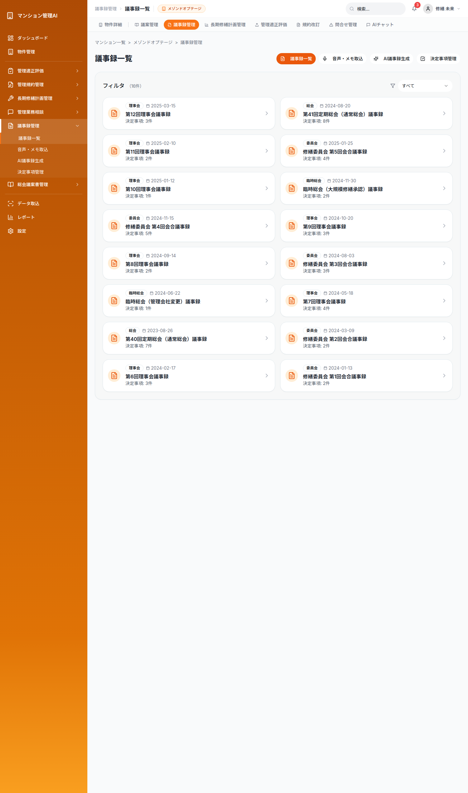

**URL**: `/minutes/list?condominiumId=:id`  
**ページタイトル**: 議事録管理

#### 画面概要

物件の全議事録を2列カードグリッドで表示。フィルタリングで絞り込みができる。

#### サブナビ

議事録一覧（アクティブ） / 音声・メモ取込 / AI議事録生成 / 決定事項管理

#### フィルタ行

| 要素 | 内容 |
|------|------|
| 件数表示 | 「N件」 |
| フィルタボタン | 絞り込み展開ボタン |
| 種別ドロップダウン | すべて / 理事会 / 総会 / 委員会 / 臨時総会 |

#### 議事録カード（2列グリッド）

各カードの構成：

| 要素 | 内容 |
|------|------|
| 種別アイコン | ドキュメントアイコン（オレンジ） |
| 議事の種類 | バッジ（理事会 / 総会 / 委員会 / 臨時総会） |
| 開催日 | カレンダーアイコン付き日付 |
| 議事録タイトル | 例：「第12回理事会議事録」 |
| 決定事項数 | 例：「決定事項：3件」 |
| 遷移矢印 | 右端「>」 |

**議事録例（16件）**:

| タイトル | 種別 | 日付 |
|---------|------|------|
| 第12回理事会議事録 | 理事会 | 2025-03-15 |
| 第41回定期総会（通常総会）議事録 | 総会 | 2024-08-20 |
| 第11回理事会議事録 | 理事会 | 2025-02-10 |
| 修繕委員会 第5回会議事録 | 委員会 | 2025-03-25 |
| 第10回理事会議事録 | 理事会 | 2025-01-12 |
| 臨時総会（大規模修繕承認）議事録 | 臨時総会 | 2024-11-30 |

---

### 5-2. 音声・メモ取込

**スクリーンショット**: `13_minutes_import.png`


**URL**: `/minutes/import?condominiumId=:id`  
**ページタイトル**: 音声・メモ取込

#### 画面概要

AI議事録生成の素材（テキストメモ・音声ファイル）を取り込む入力画面。3ステップウィザード形式。

#### ステップインジケーター

```
① 会議情報入力  →  ② 素材取込  →  ③ AI生成・確認
   （アクティブ）
```

#### 左パネル（会議基本情報）

| フィールド | 種別 | 例 |
|-----------|------|-----|
| 会議種別 | ドロップダウン（必須） | 理事会 |
| 開催日 | 日付ピッカー（必須） | 03/25/2026 |
| 出席者 | テキスト入力（カンマ区切り） | 田中理事長、鈴木副理事長、佐藤会計理事、山田理事、高橋理事、伊藤理事、渡辺理 |
| 開催場所 | テキスト入力 | メゾンドオプテージ 集会室 |

#### 右パネル（素材取込）

**入力方法タブ切り替え**：

| タブ | 内容 |
|-----|------|
| テキストメモ | 会議中に取ったメモをテキストエリアに入力。「デモサンプル表示 ＞」リンクでサンプルデータ自動挿入 |
| 音声ファイル | 音声ファイルをアップロードしWhisperで文字起こし |

**テキストメモエリア**（デモサンプル表示状態）：
> 「田中理事長：それでは第10回理事会を開始します。本日は理事7名全員が出席しております。  
> 【第1議題】令和6年度管理費収支報告…」

**遷移ボタン**: 「AI議事録生成へ進む ›」（右下オレンジ）

---

### 5-3. AI議事録生成

**スクリーンショット**: `14_minutes_generate.png`

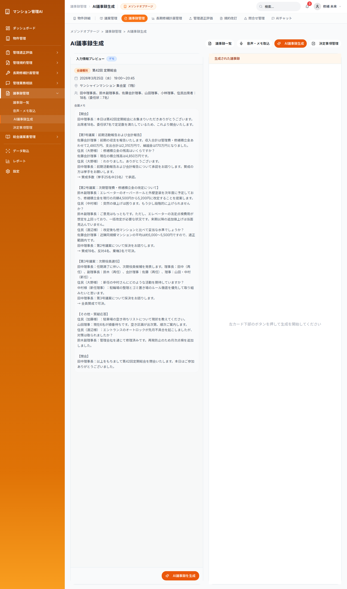

**URL**: `/minutes/generate?condominiumId=:id`  
**ページタイトル**: AI議事録生成

#### 画面概要

会議情報・素材（メモまたは音声文字起こし）をもとに、AIがフォーマット済み議事録を自動生成する画面。

#### サブナビ

議事録一覧 / 音声・メモ取込 / **AI議事録生成**（アクティブ） / 決定事項管理

#### 左パネル（入力情報プレビュー）

| 要素 | 内容 |
|------|------|
| 会議種別タグ | 例：「総会 第42回定期総会」 |
| 開催日時 | 例：2026年3月25日（水）19:00〜20:45 |
| 開催場所 | 例：サンシャインマンション 集会室（1階） |
| 出席者 | 役員名・住民出席者数（例：田中理事長、鈴木副理事長、佐藤会計理事、山田理事…住民出席者：18名、委任状7名） |
| 会議メモ | アップロードされたメモ・音声文字起こし内容（スクロール可能な大きなプレビューエリア） |

**会議メモ内容例（抜粋）**:
> 「田中理事長：本日は第42回定期総会にお集まりいただきありがとうございます。現在の出席者は198名…  
> 【第1議題：前期活動報告及び会計報告】佐藤会計理事：収入合計管理費・修繕積立金合わせ2,480万円、支出合計は2,510万円で、繰越残高は1170万円となっています…」

#### 右パネル（生成された議事録）

| 状態 | 表示内容 |
|------|---------|
| 生成前 | 「左カード下部のボタンを押して生成を開始してください」プレースホルダー |
| 生成後 | Unicodeボックス描画文字を使ったプレーンテキスト形式の議事録（等幅フォント表示） |

**生成ボタン**: 「AI議事録を生成」（オレンジ、左パネル最下部・固定）

---

### 5-4. 決定事項管理

**スクリーンショット**: `15_minutes_actions.png`

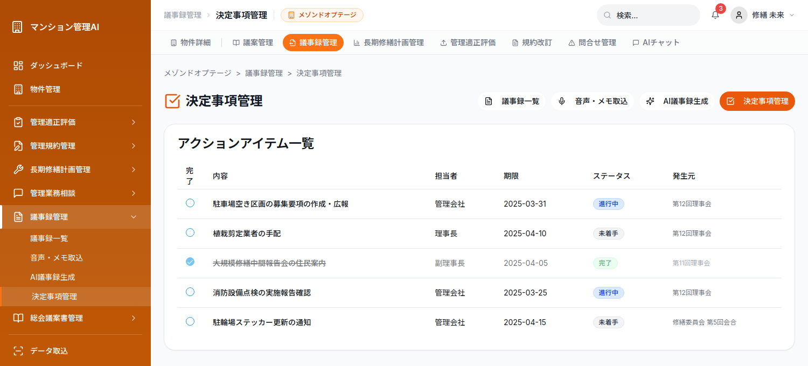

**URL**: `/minutes/actions?condominiumId=:id`  
**ページタイトル**: 決定事項管理

#### 画面概要

議事録から抽出された決定事項（アクションアイテム）を一覧管理し、実施状況を追跡する。

#### サブナビ

議事録一覧 / 音声・メモ取込 / AI議事録生成 / **決定事項管理**（アクティブ）

#### アクションアイテム一覧テーブル

| カラム | 内容 |
|--------|------|
| No. | 通し番号（チェックボックス付き） |
| 内容 | 決定事項・実施内容 |
| 担当者 | 管理会社 / 理事長等 |
| 期限 | YYYY-MM-DD |
| ステータス | バッジ（進行中=青 / 未着手=グレー / 完了=緑） |
| 発生元 | 源泉議事録名 |

**アクションアイテム例（5件）**:

| 内容 | 担当者 | 期限 | ステータス |
|------|--------|------|---------|
| 駐輪場空き区画の募集要項の作成・広報 | 管理会社 | 2025-03-31 | 進行中 |
| 補監前定業者の手配 | 理事長 | 2025-04-10 | 未着手 |
| 大規模修繕中期報告会の住民向け | 副理事長 | 2025-04-05 | 完了 |
| 消防設備点検時の実施報告書確認 | 管理会社 | 2025-03-25 | 進行中 |
| 駐輪場ステッカー更新の通知 | 管理会社 | 2025-04-15 | 未着手 |

---

## 6. 長期修繕計画管理

物件詳細のヘッダーナビ「長期修繕計画管理」から遷移。

### 6-1. 修繕計画ダッシュボード

**スクリーンショット**: `16_longterm_dashboard.png`

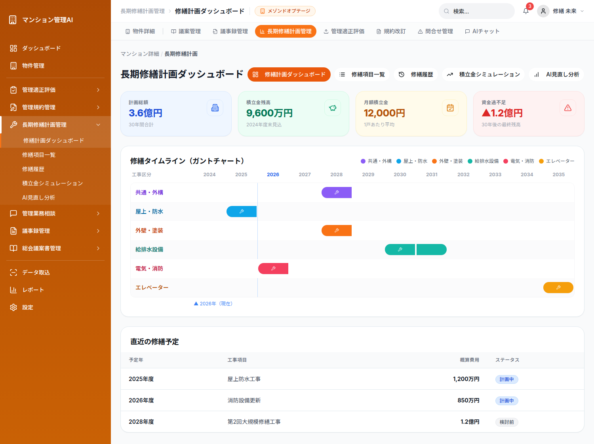

**URL**: `/longterm/dashboard?condominiumId=:id`  
**ページタイトル**: 長期修繕計画ダッシュボード

#### 画面概要

長期修繕計画の全体概況を俯瞰するダッシュボード。KPIカード・ガントチャート・直近修繕予定で構成される。

#### サブナビ

**修繕計画ダッシュボード**（アクティブ） / 修繕項目一覧 / 修繕履歴 / 積立金シミュレーション / AI見直し分析

#### KPIカード（4枚）

| カード | 値 | 補足 |
|-------|-----|------|
| 計画総額 | 3.6億円 | 30年間の累計 |
| 積立金残高 | 9,600万円 | 2024年8月時点 |
| 月間積立金 | 12,000円 | 1戸あたり |
| 資金不足 | △1.2億円 | 赤字表示・警告アイコン |

#### 修繕タイムライン（ガントチャート）

横軸：2024〜2035年  
縦軸（工事区分）：

| 区分 | バー色 |
|------|--------|
| 共通・外構 | 橙 |
| 屋上・防水 | 青 |
| 外壁・塗装 | 緑 |
| 給排水設備 | 紫 |
| 電気・消防 | 赤 |
| エレベーター | 黄 |

現在年度（2026年）を縦線でマーク。

#### 直近の修繕予定テーブル

| カラム | 内容 |
|--------|------|
| 予定年 | 年度 |
| 工事項目 | 工事名 |
| 概算費用 | 金額（万円） |
| ステータス | バッジ（計画中 / 検討完了） |

**直近修繕例（3件）**:

| 年 | 工事 | 費用 | ステータス |
|----|------|------|---------|
| 2025年度 | 屋上防水工事 | 1,200万円 | 計画中 |
| 2026年度 | 消防設備更新 | 850万円 | 計画中 |
| 2026年度 | 第2回大規模修繕工事 | 1.2億円 | 検討完了 |

---

### 6-2. 修繕項目一覧

**スクリーンショット**: `17_longterm_items.png`

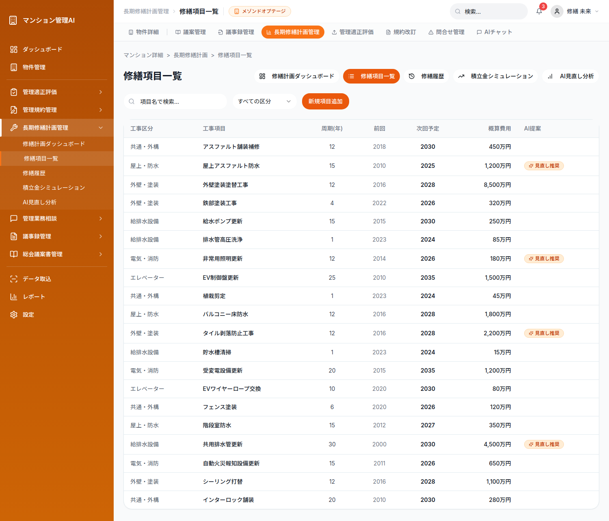

**URL**: `/longterm/items?condominiumId=:id`  
**ページタイトル**: 修繕項目一覧

#### 画面概要

長期修繕計画に登録されているすべての修繕項目をテーブル形式で一覧管理する。

#### 検索・フィルタ

| 要素 | 内容 |
|------|------|
| 検索 input | 「項目名で検索…」 |
| 区分フィルタ | ドロップダウン（すべての区分 / 共通・外構 / 屋上・防水 / 外壁・塗装 / 給排水設備 / 電気・消防 / エレベーター） |
| 新規修繕追加 | ボタン（右） |

#### テーブル

| カラム | 内容 |
|--------|------|
| 工事区分 | カテゴリ（共通・外構 / 屋上・防水 / 外壁・塗装等） |
| 工事項目 | 修繕工事名 |
| 周期（年） | 修繕周期（例：12年、15年） |
| 前回 | 最終実施年 |
| 次回予定 | 次回予定年 |
| 概算費用 | 費用見積（万円単位） |
| AI連案 | 「見直し提案」オレンジバッジ（AIが提案ありの項目） |

**修繕項目例（20件）**:

| 区分 | 工事項目 | 周期 | 次回予定 | 費用 |
|------|---------|------|---------|------|
| 共通・外構 | アスファルト舗装補修 | 12年 | 2030 | 450万円 |
| 屋上・防水 | 屋上アスファルト防水 | 15年 | 2025 | 1,200万円 |
| 外壁・塗装 | 外壁塗装塗替工事 | 12年 | 2028 | 8,500万円 |
| 給排水設備 | 給水ポンプ更新 | 15年 | 2030 | 250万円 |
| エレベーター | EV制御盤更新 | 25年 | 2035 | 1,500万円 |

---

### 6-3. 修繕履歴

**スクリーンショット**: `18_longterm_history.png`

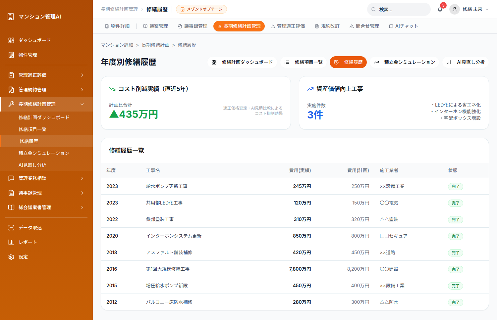

**URL**: `/longterm/history?condominiumId=:id`  
**ページタイトル**: 修繕履歴

#### 画面概要

過去に実施した修繕工事の実績を一覧表示。コスト削減効果と資産価値向上工事を集計表示する。

#### サマリカード（2枚）

| カード | 内容 |
|-------|------|
| コスト削減実績（直近5年） | △435万円（計画比合計節約、追加費用節約などを明示） |
| 資産価値向上工事 | 3件（LED化・インターホン強化・宅配ボックス増設） |

#### 修繕履歴テーブル

| カラム | 内容 |
|--------|------|
| 年度 | 実施年（西暦） |
| 工事名 | 修繕工事の名称 |
| 費用（実績） | 実際にかかった費用（万円） |
| 費用（計画） | 当初計画費用（万円） |
| 施工者 | 施工会社名 |
| 状況 | 完了バッジ（緑） |

**履歴例（8件）**:

| 年度 | 工事名 | 費用(実績) | 施工者 |
|------|--------|-----------|--------|
| 2023 | 給水ポンプ更新工事 | 245万円 | **設備工業 |
| 2023 | 共用部航LED化工事 | 120万円 | △△電気 |
| 2022 | 鉄部塗装工事 | 310万円 | △△塗装 |
| 2020 | インターホンシステム更新 | 850万円 | □□セキュア |
| 2018 | アスファルト舗装補修 | 420万円 | **造路 |
| 2016 | 屋上大規模修繕工事 | 7,800万円 | ○○組 |
| 2015 | 増圧給水ポンプ新設 | 450万円 | **設備工業 |
| 2012 | バルコニー床防水修繕 | 280万円 | △△防水 |

---

### 6-4. 積立金シミュレーション

**スクリーンショット**: `19_longterm_simulation.png`

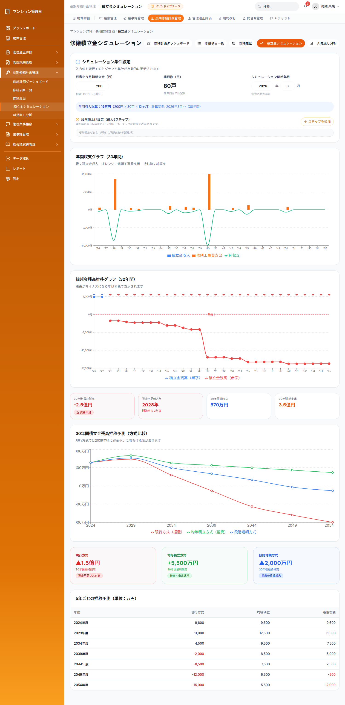

**URL**: `/longterm/simulation?condominiumId=:id`  
**ページタイトル**: 修繕積立金シミュレーション

#### 画面概要

積立金の収支を30年間でシミュレーションし、資金不足リスクと積立方式比較を可視化する。

#### サブナビ

修繕計画ダッシュボード / 修繕項目一覧 / 修繕履歴 / **積立金シミュレーション**（アクティブ） / AI見直し分析

#### シミュレーション条件設定

| 項目 | 設定値 |
|------|--------|
| 総戸数 | 80戸 |
| シミュレーション開始月 | 2028年3月 |
| 段階的値上げ（ステップ） | 追加設定可能（「＋ステップを追加」ボタン） |

#### グラフ1：年間収支グラフ（30年間）

**種別**: 折れ線＋棒グラフ複合  
**凡例**: 積立収入（橙）/ 修繕工事費支出（赤）/ 純収支（緑線）  
**横軸**: 年（1〜30年目）  
**縦軸**: 金額（億円単位）

#### グラフ2：繰越金残高推移グラフ（30年間）

**種別**: 折れ線グラフ  
**凡例**: 繰越金残高（黒）/ 繰越金残高（赤・赤字時）  
**特徴**: 残高がゼロを下回る年度を赤線で強調

#### KPI表示（4指標）

| 指標 | 値 |
|------|-----|
| 30年後 積立残高 | △2.5億円（赤） |
| 資金不足 | 2028年（予測） |
| 10年後残高 | 370万円 |
| 10年後不足 | 3.5億円 |

#### グラフ3：30年間積立残高最高予測（方式比較）

**種別**: 折れ線グラフ（3本）  
**凡例**: 均等方式（赤）/ 市場積立方式（黒）/ 段階積立方式（青破線）

#### 方式比較カード（3枚）

| 方式 | 評価 | 特徴 |
|------|------|------|
| 均等方式 | △1.5億円 | 短期的に負担大・長期的に安定 |
| 市場積立方式 | ＋5,500万円 | 市場環境に応じて柔軟調整 |
| 段階積立方式 | △2,000万円 | 初期負担軽減・後期値上げ必要 |

#### 5年ごとの推移予測テーブル

年次別（2024〜2054年、5年刻み）で各方式の残高を数値一覧表示。

---

### 6-5. AI見直し分析

**スクリーンショット**: `20_longterm_analysis.png`

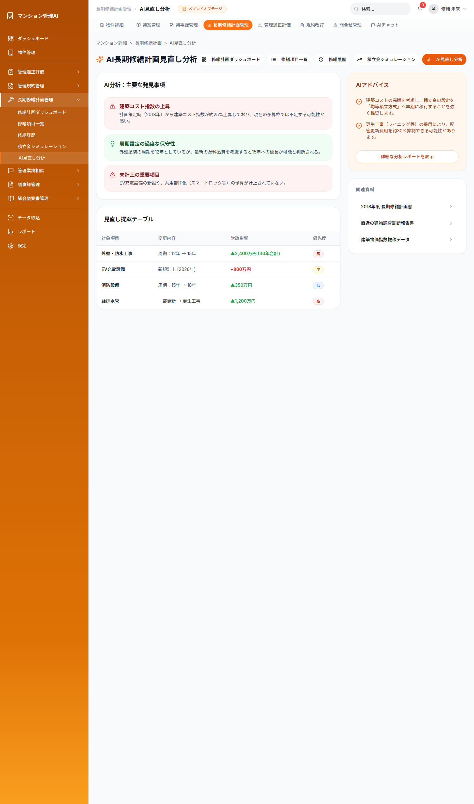

**URL**: `/longterm/analysis?condominiumId=:id`  
**ページタイトル**: AI長期修繕計画見直し分析

#### 画面概要

AIが現行の長期修繕計画を分析し、見直しポイント・提案事項をアドバイスする。

#### サブナビ

修繕計画ダッシュボード / 修繕項目一覧 / 修繕履歴 / 積立金シミュレーション / **AI見直し分析**（アクティブ）

#### 左パネル（AI分析結果）

**AI分析：主要な発見事項**（3件）：

| アイコン | 発見事項 | 内容 |
|---------|---------|------|
| △ 赤 | 建築コスト指数の上昇 | 計画策定時（2018年）から建築コスト指数が約25%上昇しており、現在の予算枠では不足する可能性が高い |
| ○ 黄 | 修繕設定の過度な保守性 | 外壁塗装の周期を12年としているが、最新の塗料品質を考慮すると15年への延長が合理的と判断される |
| △ 赤 | 未計上の重要項目 | EV充電設備の新設や、共用部IoT化（スマートロック等）の予算が計上されていない |

#### 右パネル（AIアドバイス）

| 要素 | 内容 |
|------|------|
| AIアドバイス | 建築コストの高騰を考慮し、積立金の設定を「均等積立方式」へ早急に移行することを強く推奨。「段階積立方式（ライジング型）」の保険として積立率を30%引き上げる選択肢もある |
| 関連資料リンク | 2018年度 長期修繕計画書 / 直近の建物設備診断報告書 / 建築物価指数推移データ |

#### 見直し提案テーブル

| 修繕項目 | 変更内容 | 財政影響 | 優先度 |
|---------|---------|---------|--------|
| 外壁・防水工事 | 周期：12年→15年 | △2,400万円（30年合計） | 高 |
| EV充電設備 | 新規計上（2026年） | ＋800万円 | 中 |
| 消防設備 | 周期：15年→18年 | △350万円 | 低 |
| 給排水管 | 一部更新→更生工事 | △1,200万円 | 高 |

---

## 7. 規約改訂

物件詳細のヘッダーナビ「規約改訂」から遷移。

### 7-1. 規約改訂分析

**スクリーンショット**: `21_regulation_analysis.png`

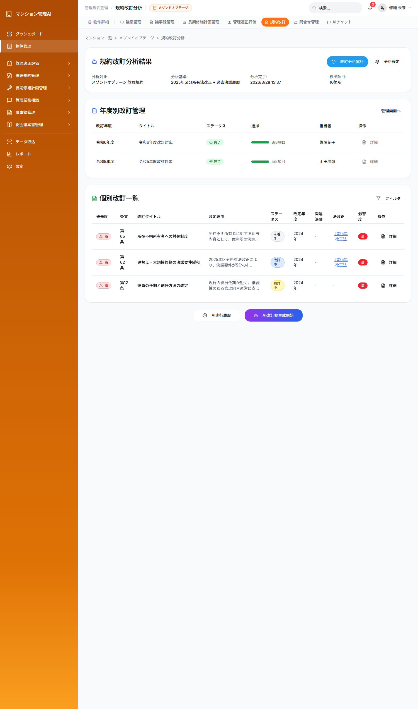

**URL**: `/condominiums/:id/regulation-analysis`  
**ページタイトル**: 規約改訂分析結果

#### 画面概要

現行の管理規約をAIが分析し、法令・標準管理規約との乖離を洗い出した結果を表示する。

#### 分析情報ヘッダー

| 項目 | 内容 |
|------|------|
| 分析対象 | メゾンドオプテージ 管理規約 |
| 分析基準 | 2025年区分所有法改正＋過去決議履歴 |
| 分析日時 | 2026/3/26 15:37 |
| 抽出項目数 | 10箇所 |

#### 操作ボタン

| ボタン | 説明 |
|--------|------|
| 規約分析実行 | 再分析をトリガー（オレンジ） |
| 分析設定 | 分析パラメータの設定 |

#### 年度別改訂管理

| 改訂年度 | タイトル | ステータス | 進捗 |
|---------|---------|---------|------|
| 令和6年度 | 令和6年度改訂対応 | 完了 | 5/5項目 |
| 令和5年度 | 令和5年度改訂対応 | 完了 | 5/5項目 |

右上「管理画面へ」リンクで年度別改訂管理画面に遷移。

#### 個別改訂一覧テーブル

| カラム | 内容 |
|--------|------|
| 優先度 | バッジ（高=赤 / 中=橙 / 低=青） |
| 条文 | 第N条 |
| 改訂タイトル | 改訂の件名 |
| 改訂理由 | 理由の説明文 |
| ステータス | バッジ（未着手 / 検討中 / 完了） |
| 改訂年度 | 対象年度 |
| 過去決議 | 関連決議リンク |
| 法改正 | 関連法令バッジ（2025年改正法等） |
| 影響度 | 高/中/低バッジ |
| 操作 | 「詳細」ボタン |

**個別改訂例（3件）**:

| 優先 | 条文 | タイトル |
|------|------|---------|
| 高 | 第65条 | 所在不明所有者への対処規定 |
| 高 | 第62条 | 建替え・大規模修繕の決議要件緩和 |
| 中 | 第12条 | 役員の任期と選任方法の改定 |

**フッターボタン**:  
「AI実行履歴」（テキストリンク） / 「AI改訂案生成開始」（紫ボタン）

---

### 7-2. AI改訂案生成

**スクリーンショット**: `22_ai_revision.png`

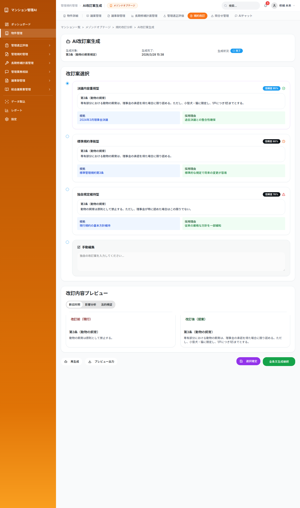

**URL**: `/condominiums/:id/ai-revision`  
**ページタイトル**: AI改訂案生成

#### 画面概要

分析で抽出された改訂候補に対して、AIが複数の改訂オプションを生成する。ユーザーはオプションを選択・比較して最終案を決定する。

#### 生成情報ヘッダー

| 項目 | 内容 |
|------|------|
| 生成対象 | 第3条（動物の飼育規定） |
| 生成月日 | 2026/3/28 15:38 |
| 生成状況 | 完了バッジ（青） |

#### 改訂案選択（ラジオボタン）

4つの改訂オプションから選択：

**① 決議内容準拠型（信頼度97%）** ← デフォルト選択

> 第3条（動物の飼育）：専有部分における動物の飼育は、理事会の承認を得た場合に限り認める。ただし、小型犬・猫に限定し、1戸につき1匹までとする。

| 欄 | 内容 |
|----|------|
| 根拠 | 2024年3月理事会決議 |
| 採用理由 | 過去決議との整合性確保 |

**② 標準規約準拠型（信頼度85%）**

> 第3条（動物の飼育）：専有部分における動物の飼育は、理事会の承認を得た場合に限り認める。

| 欄 | 内容 |
|----|------|
| 根拠 | 標準管理規約第3条 |
| 採用理由 | 標準規約の規定で将来の変更に容易 |

**③ 独自規定維持型（信頼度79%）**

> 動物の飼育は原則として禁止する。ただし、理事会が特に認めた場合はこの限りでない。

| 欄 | 内容 |
|----|------|
| 根拠 | 現行規約の基本方針維持 |
| 採用理由 | 従来の基準な方針を一部緩和 |

**④ 手動編集**

> 独自の改訂案を入力してください…（テキストエリア）

#### 改訂内容プレビュー

**タブ切り替え**: 新旧対照 / 影響分析 / 法的検証

**新旧対照タブ**（2カラム）：

| 欄 | 内容 |
|----|------|
| 改訂前（現行） | 第3条（動物の飼育）：動物の飼育は原則として禁止する |
| 改訂後（提案） | 第3条（動物の飼育）：専有部分における動物の飼育は、理事会の承認を得た場合に限り認める。ただし、小型犬・猫に限定し、1戸につき1匹までとする |

#### フッター操作ボタン

| ボタン | 説明 |
|--------|------|
| 再生成 | AI再生成をトリガー |
| プレビュー出力 | PDF/Word出力 |
| 選択確定 | 選択した案を確定（紫） |
| 全条文生成継続 | 残り全条文の改訂案を生成（橙） |

---

### 7-3. ナレッジベース管理

**スクリーンショット**: `23_knowledge_base.png`

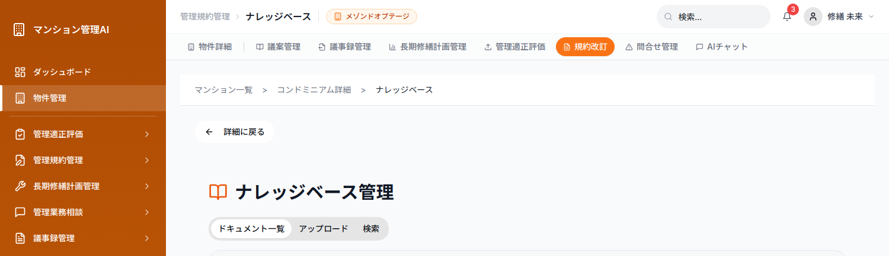

**URL**: `/condominiums/:id/knowledge`  
**ページタイトル**: ナレッジベース管理

#### 画面概要

RAG（検索補強生成）用のドキュメントをアップロード・管理・検索する画面。AIチャット相談の回答精度向上に利用する。

#### タブ構成

| タブ | 内容 |
|-----|------|
| ドキュメント一覧 | 登録済みドキュメントの一覧（デフォルト） |
| アップロード | 新規ドキュメントのアップロード |
| 検索 | ドキュメント横断のセマンティック検索 |

#### ドキュメント一覧（空状態）

「ナレッジドキュメントがありません  
『アップロード』タブからドキュメントを追加してください」  
（ドキュメントアイコン付き空状態メッセージ）

---

### 7-4. 規約Wiki

**スクリーンショット**: `24_regulation_wiki.png`

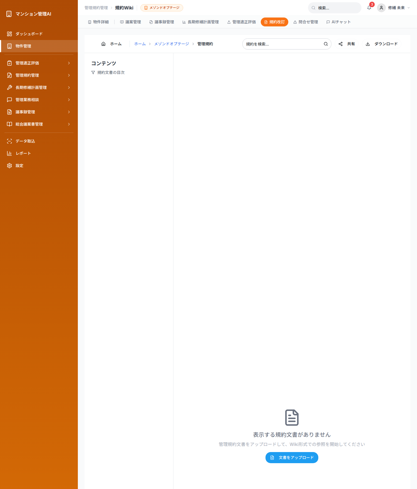

**URL**: `/condominiums/:id/wiki`  
**ページタイトル**: 規約Wiki

#### 画面概要

管理規約をWiki形式で閲覧・検索できる画面。条文の目次ナビゲーションと全文検索を提供する。

#### レイアウト

**左サイドバー（目次）**:  
条文の目次ツリー（アップロード後に展開）

**右メインエリア**:  
パンくず: ホーム ＞ メゾンドオプテージ ＞ 管理規約  
検索バー（条文内検索）  
「共有」「ダウンロード」ボタン（右上）

#### 空状態

「表示する規約文書がありません  
管理規約文書をアップロードして、Wiki形式での参照を開始してください」  
「文書をアップロード」ボタン（青）

---

### 7-5. 年度別改訂管理

**スクリーンショット**: `25_revision_years.png`

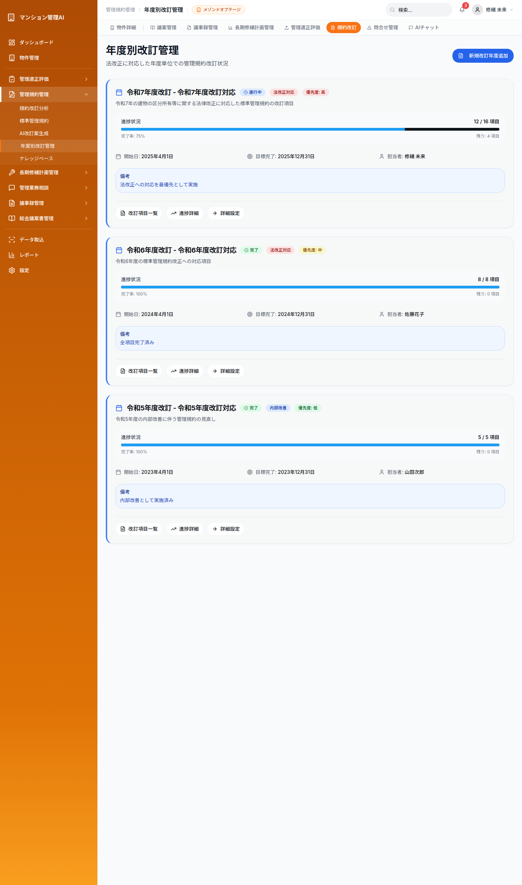

**URL**: `/revision-years?condominiumId=:id`  
**ページタイトル**: 年度別改訂管理

#### 画面概要

法改正への対応を年度単位で管理し、各年度の改訂進捗を可視化する。

#### ページ説明文

「法改正に対応した年度単位での管理規約改訂状況」

**新規改訂年度追加**ボタン（右上）

#### 年度カード（3件）

各カードの構成：

| 要素 | 内容 |
|------|------|
| カレンダーアイコン | カード左端 |
| タイトル | 例：「令和7年度改訂 — 令和7年度改訂対応」 |
| 説明 | 対応内容の説明 |
| ステータスバッジ | 進行中（黒） / 完了（緑） |
| 法改正対応バッジ | 法改正対応（青） |
| 優先度バッジ | 優先度:高（赤）/ 優先度:中（黄）/ 優先度:低（グレー） |
| 進捗バー | 達成割合（%）を視覚化 |
| 進捗数値 | 例：「12 / 16 項目」「残り：4項目」 |
| 達成率 | 「完了率：75%」 |
| 開始日・目標日 | 例：「開始: 2025年4月1日 / 目標完了: 2025年12月31日」 |
| 担当者 | 例：「担当者：修繕 未来様」 |
| 備考 | 自由記述 |
| 操作リンク | 「改訂項目一覧」「進捗詳細 →」「詳細設定 →」 |

**年度カード一覧**:

| 年度 | タイトル | ステータス | 達成率 |
|------|---------|---------|--------|
| 令和7年度 | 令和7年の区分所有法改正対応 | 進行中 | 12/16（75%） |
| 令和6年度 | 令和6年の標準管理規約改訂対応 | 完了 | 8/8（100%） |
| 令和5年度 | 令和5年の内部改善措置 | 完了 | 5/5（100%） |

---

## 8. 管理適正評価

物件詳細のヘッダーナビ「管理適正評価」から遷移。

### 8-1. セルフチェック実施

**スクリーンショット**: `26_evaluation_check.png`

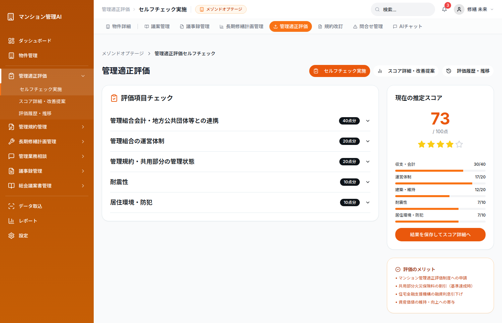

**URL**: `/evaluation/check?condominiumId=:id`  
**ページタイトル**: 管理適正評価

#### 画面概要

マンション管理計画認定制度に基づくセルフチェックを実施し、現在の管理状態をスコアリングする。

#### サブナビ

**セルフチェック実施**（アクティブ） / スコア詳細・改善策 / 評価履歴・推移

#### レイアウト（2カラム）

**左パネル（評価項目チェック）**:

| カテゴリ | 配点 | チェック項目 |
|---------|------|------------|
| 管理組合・地方公共団体等との連携 | 40点 | 展開可能なアコーディオン |
| 管理組合の運営体制 | 20点 | 〃 |
| 管理規約・共用部分の管理状態 | 20点 | 〃 |
| 耐震性 | 10点 | 〃 |
| 居住環境・防犯 | 10点 | 〃 |

各カテゴリはアコーディオンで展開し、チェックボックス形式で個別項目を評価。

**右パネル（リアルタイムスコア表示）**:

| 要素 | 内容 |
|------|------|
| 現在の推定スコア | 73 / 100（大きな数字で表示） |
| 星評価 | ★★★★☆ |
| カテゴリ別スコアバー | 横棒グラフ（収支・会計30/40、運営15/20、建物・維持12/20、耐震7/10、居住環境・防犯7/10） |
| 次ステップボタン | 「結果を保存してスコア詳細へ」（橙ボタン） |

---

### 8-2. スコア詳細・改善策

**スクリーンショット**: `27_evaluation_score.png`

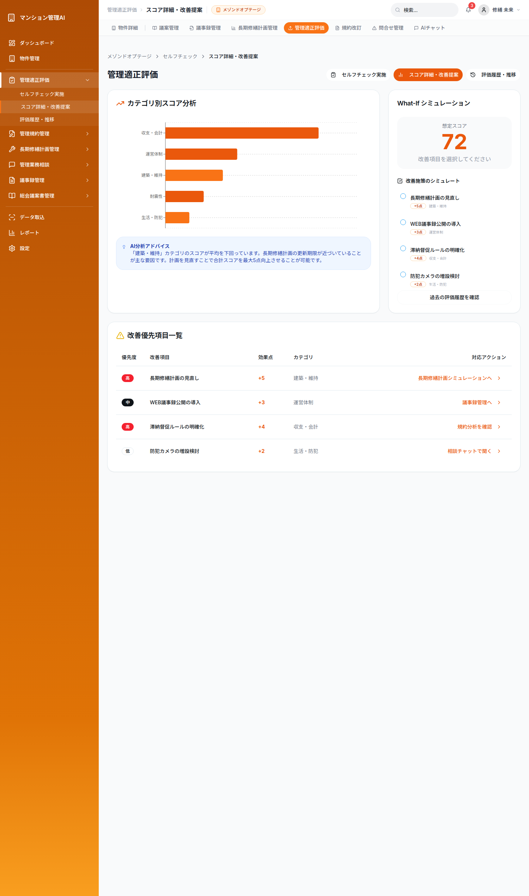

**URL**: `/evaluation/score?condominiumId=:id`  
**ページタイトル**: 管理適正評価

#### 画面概要

セルフチェック結果の詳細分析と、スコアアップのためのWhat-ifシミュレーション・改善優先項目を表示する。

#### サブナビ

セルフチェック実施 / **スコア詳細・改善策**（アクティブ） / 評価履歴・推移

#### レイアウト（2カラム）

**左パネル（スコア分析）**:

**カテゴリ別スコア分析**（横棒グラフ）：

| カテゴリ | スコアバー |
|---------|---------|
| 収支・会計 | 高（橙） |
| 運営体制 | 中 |
| 建物・維持 | 中低 |
| 耐震性 | 低 |
| 生活・防犯 | 低 |

**AI分析アドバイス**（ベージュ背景）：  
「建物・維持」カテゴリのスコアが平均を下回っています。長期修繕計画の更新時期が近づいていることが主な要因です。計画を更新することで合計スコアを最大6点上げることができます。

**右パネル（What-if シミュレーション）**:

| 要素 | 内容 |
|------|------|
| 推定スコア表示 | 72（大数字） |
| 改善策セレクト | チェックボックスで改善施策を選択 |

**選択可能改善策（4件）**:

| 改善施策 | 効果 |
|---------|------|
| 長期修繕計画の見直し | ＋6点 |
| WEB議事録公開の導入 | ＋3点 |
| 滞納督促ルールの明確化 | ＋4点 |
| 防犯カメラの増設検討 | ＋2点 |

各改善策にはリンク（「長期修繕計画シミュレーションへ」「議事録管理へ」「規約分析へ確認」「相談チャットで聞く」）が設定され、該当機能に直接遷移できる。

#### 改善優先項目一覧テーブル（下部）

| カラム | 内容 |
|--------|------|
| 優先度 | 高（赤）/ 中（橙）/ 低（青） |
| 改善項目 | 具体的な改善事項 |
| 効果点 | スコア上昇予測値 |
| カテゴリ | 対象カテゴリ名 |
| 対応アクション | 他画面へのリンク |

---

### 8-3. 評価履歴・推移

**スクリーンショット**: `28_evaluation_history.png`

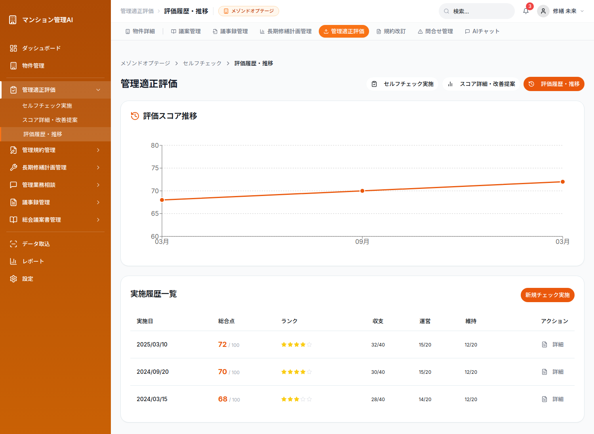

**URL**: `/evaluation/history?condominiumId=:id`  
**ページタイトル**: 管理適正評価

#### 画面概要

過去の評価スコアの推移を折れ線グラフと実施履歴テーブルで可視化する。

#### サブナビ

セルフチェック実施 / スコア詳細・改善策 / **評価履歴・推移**（アクティブ）

#### 評価スコア推移グラフ

**種別**: 折れ線グラフ  
**横軸**: 実施月（03月 / 09月 / 03月）  
**縦軸**: スコア（60〜80点範囲）  
**折れ線**: オレンジ・右肩上がり傾向（68→70→72）

#### 実施履歴一覧テーブル

**右上**: 「新規チェック実施」ボタン（橙）

| カラム | 内容 |
|--------|------|
| 実施日 | YYYY/MM/DD |
| 総合点 | N / 100（赤色表示） |
| ランク | 星評価（★★★〜★★★★★） |
| 収支 | カテゴリ別点数 |
| 運営 | 〃 |
| 維持 | 〃 |
| アクション | 「詳細」ボタン |

**実施履歴（3件）**:

| 実施日 | 総合点 | ランク | 収支 | 運営 | 維持 |
|--------|--------|--------|------|------|------|
| 2025/03/10 | 72点 | ★★★★ | 32/40 | 15/20 | 12/20 |
| 2024/09/20 | 70点 | ★★★★ | 30/40 | 15/20 | 12/20 |
| 2024/03/15 | 68点 | ★★★ | 28/40 | 14/20 | 12/20 |

---

## 付録：スクリーンショット一覧

| No. | ファイル名 | 画面名 | URL |
|-----|-----------|--------|-----|
| 01 | `01_condominium_list.png` | マンション一覧 | `/condominiums` |
| 02 | `02_condominium_detail_basic.png` | 物件詳細（基本情報） | `/condominiums/:id` |
| 03 | `03_condominium_detail_members.png` | 物件詳細（組合員リスト） | `/condominiums/:id` |
| 04 | `04_condominium_detail_committees.png` | 物件詳細（各種専門部会） | `/condominiums/:id` |
| 05 | `05_condominium_detail_notes.png` | 物件詳細（特記事項） | `/condominiums/:id` |
| 06 | `06_condominium_detail_files.png` | 物件詳細（その他ファイル） | `/condominiums/:id` |
| 07 | `07_consultation_chat.png` | チャット相談 | `/consultation/chat` |
| 08 | `08_consultation_history.png` | 相談履歴 | `/consultation/history` |
| 09 | `09_proposals_list.png` | 議案一覧 | `/proposals/list` |
| 10 | `10_proposals_generate.png` | AI議案書生成 | `/proposals/generate` |
| 11 | `11_proposals_edit.png` | 議案詳細・編集 | `/proposals/edit` |
| 12 | `12_minutes_list.png` | 議事録一覧 | `/minutes/list` |
| 13 | `13_minutes_import.png` | 音声・メモ取込 | `/minutes/import` |
| 14 | `14_minutes_generate.png` | AI議事録生成 | `/minutes/generate` |
| 15 | `15_minutes_actions.png` | 決定事項管理 | `/minutes/actions` |
| 16 | `16_longterm_dashboard.png` | 修繕計画ダッシュボード | `/longterm/dashboard` |
| 17 | `17_longterm_items.png` | 修繕項目一覧 | `/longterm/items` |
| 18 | `18_longterm_history.png` | 修繕履歴 | `/longterm/history` |
| 19 | `19_longterm_simulation.png` | 積立金シミュレーション | `/longterm/simulation` |
| 20 | `20_longterm_analysis.png` | AI見直し分析 | `/longterm/analysis` |
| 21 | `21_regulation_analysis.png` | 規約改訂分析 | `/condominiums/:id/regulation-analysis` |
| 22 | `22_ai_revision.png` | AI改訂案生成 | `/condominiums/:id/ai-revision` |
| 23 | `23_knowledge_base.png` | ナレッジベース管理 | `/condominiums/:id/knowledge` |
| 24 | `24_regulation_wiki.png` | 規約Wiki | `/condominiums/:id/wiki` |
| 25 | `25_revision_years.png` | 年度別改訂管理 | `/revision-years` |
| 26 | `26_evaluation_check.png` | セルフチェック実施 | `/evaluation/check` |
| 27 | `27_evaluation_score.png` | スコア詳細・改善策 | `/evaluation/score` |
| 28 | `28_evaluation_history.png` | 評価履歴・推移 | `/evaluation/history` |
